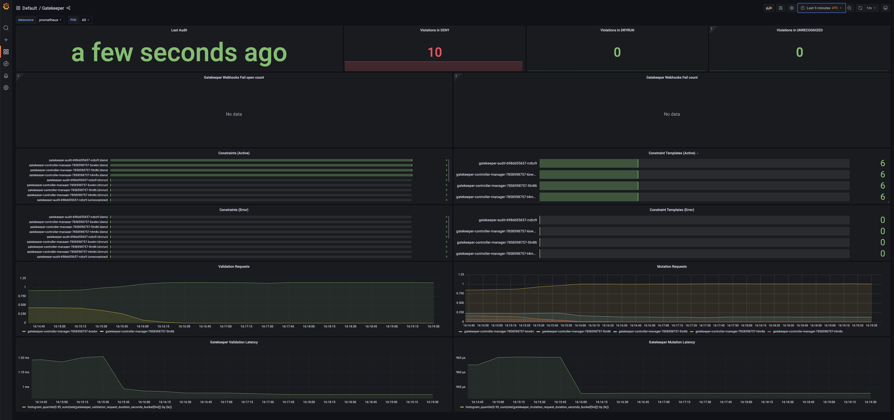
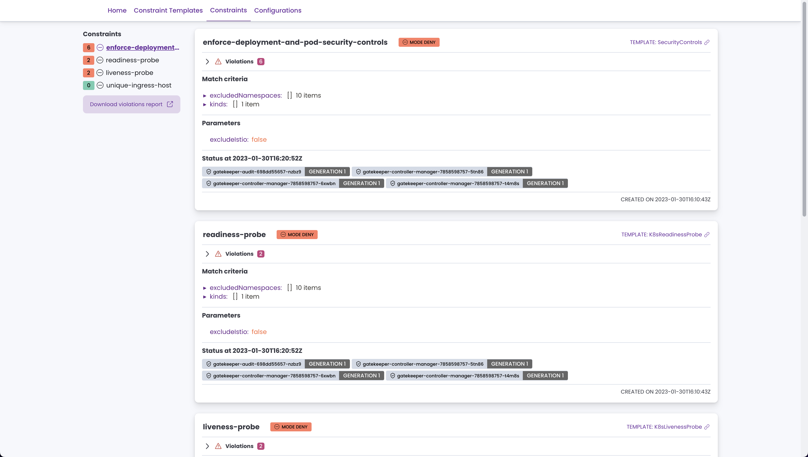

<!-- markdownlint-disable MD033 -->
<h1>
    
    Kubernetes Fury OPA
</h1>
<!-- markdownlint-enable MD033 -->


<!-- <KFD-DOCS> -->

**Kubernetes Fury OPA** provides policy enforcement at runtime for the [Kubernetes Fury Distribution (KFD)][kfd-repo].

If you are new to KFD please refer to the [official documentation][kfd-docs] on how to get started with KFD.

## Overview

The Kubernetes API server provides a mechanism to review every request that is made (object creation, modification, or deletion). To use this mechanism the API server allows us to create a [Validating Admission Webhook][kubernetes-vaw-docs] that, as the name says, will validate every request and let the API server know if the request is allowed or not based on some logic (policy).

**Kubernetes Fury OPA** module is based on [OPA Gatekeeper][gatekeeper-page] and [Kyverno][kyverno-page], two popular open-source Kubernetes-native policy engines that runs as a Validating Admission Webhook. It allows writing custom constraints (policies) and enforcing them at runtime.

[SIGHUP][sighup-page] provides a set of base constraints that could be used both as a starting point to apply constraints to your current workloads and to give you an idea of how to implement new rules matching your requirements.

## Packages

Fury Kubernetes OPA provides the following packages:

| Package                                                | Version   | Description                                                                                                                                             |
| ------------------------------------------------------ | --------- | ------------------------------------------------------------------------------------------------------------------------------------------------------- |
| [Gatekeeper Core](katalog/gatekeeper/core)             | `v3.14.0` | Gatekeeper deployment, ready to enforce rules.                                                                                                          |
| [Gatekeeper Rules](katalog/gatekeeper/rules)           | `N.A.`    | A set of custom rules to get started with policy enforcement.                                                                                           |
| [Gatekeeper Monitoring](katalog/gatekeeper/monitoring) | `N.A.`    | Metrics, alerts and dashboard for monitoring Gatekeeper.                                                                                                |
| [Gatekeeper Policy Manager](katalog/gatekeeper/gpm)    | `v1.0.9`  | Gatekeeper Policy Manager, a simple to use web-ui for Gatekeeper.                                                                                       |
| [Kyverno](katalog/kyverno)                             | `v1.11.4` | Kyverno is a policy engine designed for Kubernetes. It can validate, mutate, and generate configurations using admission controls and background scans. |

Click on each package name to see its full documentation.

## Compatibility

| Kubernetes Version |   Compatibility    | Notes            |
| ------------------ | :----------------: | ---------------- |
| `1.25.x`           | :white_check_mark: | No known issues. |
| `1.26.x`           | :white_check_mark: | No known issues  |
| `1.27.x`           | :white_check_mark: | No known issues  |


Check the [compatibility matrix][compatibility-matrix] for additional information on previous releases of the module.

## Usage

### Prerequisites

| Tool                                    | Version    | Description                                                                                                                                                    |
| --------------------------------------- |------------| -------------------------------------------------------------------------------------------------------------------------------------------------------------- |
| [furyctl][furyctl-repo]                 | `>=0.27.0` | The recommended tool to download and manage KFD modules and their packages. To learn more about `furyctl` read the [official documentation][furyctl-repo].     |
| [kustomize][kustomize-repo]             | `>=3.10.0` | Packages are customized using `kustomize`. To learn how to create your customization layer with `kustomize`, please refer to the [repository][kustomize-repo]. |
| [KFD Monitoring Module][kfd-monitoring] | `>v1.10.0` | Expose metrics to Prometheus *(optional)* and use Grafana Dashboards.                                                                                          |

> You can comment out the service monitor in the [kustomization.yaml][core-kustomization] file if you don't want to install the monitoring module.

### Gatekeeper deployment

1. List the packages you want to deploy and their version in a `Furyfile.yml`

```yaml
bases:
  - name: opa/gatekeeper
    version: "1.11.1"
```

> See `furyctl` [documentation][furyctl-repo] for additional details about `Furyfile.yml` format.

2. Execute `furyctl legacy vendor -H` to download the packages

3. Inspect the download packages under `./vendor/katalog/opa/gatekeeper`.

4. Define a `kustomization.yaml` that includes the `./vendor/katalog/opa/gatekeeper` directory as a resource.

```yaml
resources:
  - ./vendor/katalog/opa/gatekeeper
```

5. Apply the necessary patches. You can find a list of common customization [here](#common-customizations).

6. To deploy the packages to your cluster, execute:

```bash
kustomize build . | kubectl apply -f -
```

> ⚠️ Gatekeeper is deployed by default as a Fail open (also called `Ignore` mode) Admission Webhook. Should you decide to change it to `Fail` mode read carefully [the project's documentation on the topic first][gatekeeper-failmode].
<!-- space intentionally left blank -->
> ⚠️ If you decide to deploy Gatekeeper to a different namespace than the default `gatekeeper-system`, you'll need to patch the file `vwh.yml` to point to the right namespace for the webhook service due to limitations in the `kustomize` tool.

#### Common Customizations

##### Exempting a namespace

Gatekeeper supports 3 levels of granularity to exempt a namespace from policy enforcement.

1. Global exemption at Kubernetes API webhook level: the requests to the API server for the namespace won't be sent to Gatekeeper's webhook.
2. Global exemption at Gatekeeper configuration level: requests to the API server for the namespace will be sent to Gatekeeper's webhook, but Gatekepeer will not enforce constraints for the namespace. It is the equivalent of exempting the namespace in all the constraints. Useful when you don't want any of the constraints enforced in a namespace.
3. Exemption at constraint level: you can exempt namespaces in the definition of each constraint. Useful when you may want only a subset of all the constraints to be enforced in a namespace.

> ⚠️ Exempting critical namespaces like `kube-system` or `logging` [won't guarantee that the cluster will function properly when Gatekeeper webhook is in `Fail` mode][gatekeeper-failmode].

For more details on how to implement the exemption, please refer to the [official Gatekeeper documentation site][gatekeeper-exemption].

##### Disable constraints

Disable one of the default constraints by creating the following kustomize patch:

```yml
patchesJson6902:
    - target:
          group: constraints.gatekeeper.sh
          version: v1beta1
          kind: K8sUniqueIngressHost # replace with the kind of the constraint you want to disable
          name: unique-ingress-host # replace with the name of the constraint you want to disable
      path: patches/allow.yml
```

add this to the `patches/allow.yml` file:

```yml
- op: "replace"
  path: "/spec/enforcementaction"
  value: "allow"
```

#### Emergency brake

If for some reason OPA Gatekeeper is giving you issues and blocking normal operations in your cluster, you can disable it by removing the Validating Admission Webhook definition from your cluster:

```bash
kubectl delete ValidatingWebhookConfiguration gatekeeper-validating-webhook-configuration
```

#### Monitoring

Gatekeeper is configured by default in this module to expose some Prometheus metrics about its health, performance, and operative information.

You can monitor and review these metrics by checking out the provided Grafana dashboard. (This requires the KFD Monitoring Module to be installed).

Go to your cluster's Grafana and search for the "Gatekeeper" dashboard:

<!-- markdownlint-disable MD033 -->

<a href="docs/images/screenshots/grafana-dashboard.png"></a>

<!-- markdownlint-enable MD033 -->

You can also use [Gatekeeper Policy Manager](katalog/gatekeeper/gpm/README.md) to view the Constraints Templates, Constraints, and Violations in a simple-to-use UI.


<!-- markdownlint-disable MD033 -->

<a href="docs/images/screenshots/gpm-screenhost.png"></a>

<!-- markdownlint-enable MD033 -->

Two alerts are also provided by default with the module, the alerts are triggered when the number of errors seen by the Kubernetes API server trying to contact Gatekeeper's webhook is too high. Both for Fail open (`Ignore`) mode and Fail mode:

| Alert                         | Description                                                                                                                                 |
| ----------------------------- | ------------------------------------------------------------------------------------------------------------------------------------------- |
| GatekeeperWebhookFailOpenHigh | Gatekeeper is not enforcing {{$labels.type}} requests to the API server.                                                                    |
| GatekeeperWebhookCallError    | Kubernetes API server is rejecting all requests because Gatekeeper's webhook '{{ $labels.name }}' is failing for '{{ $labels.operation }}'. |

Notice that the alert for when the Gatekeeper webhook is in `Ignore` mode (the default) depends on an API server metric that has been added in Kubernetes version 1.24. Previous versions of Kubernetes won't trigger alerts when the webhook is failing and in `Ignore` mode.

### Kyverno deployment

1. List the packages you want to deploy and their version in a `Furyfile.yml`

```yaml
bases:
  - name: opa/kyverno
    version: "1.11.1"
```

> See `furyctl` [documentation][furyctl-repo] for additional details about `Furyfile.yml` format.

2. Execute `furyctl legacy vendor -H` to download the packages

3. Inspect the download packages under `./vendor/katalog/opa/kyverno`.

4. Define a `kustomization.yaml` that includes the `./vendor/katalog/opa/kyverno` directory as a resource.

```yaml
resources:
  - ./vendor/katalog/opa/kyverno
```

5. To deploy the packages to your cluster, execute:

```bash
kustomize build . | kubectl apply -f -
```

<!-- Links -->
[gatekeeper-page]: https://github.com/open-policy-agent/gatekeeper
[gatekeeper-failmode]: https://open-policy-agent.github.io/gatekeeper/website/docs/failing-closed/
[gatekeeper-exemption]: https://open-policy-agent.github.io/gatekeeper/website/docs/exempt-namespaces/
[kyverno-page]: https://github.com/kyverno/kyverno
[kubernetes-vaw-docs]: https://kubernetes.io/docs/reference/access-authn-authz/extensible-admission-controllers/
[kfd-monitoring]: https://github.com/sighupio/fury-kubernetes-monitoring
[core-kustomization]: ./katalog/gatekeeper/core/kustomization.yaml
[furyctl-repo]: https://github.com/sighupio/furyctl
[sighup-page]: https://sighup.io
[kfd-repo]: https://github.com/sighupio/fury-distribution
[kustomize-repo]: https://github.com/kubernetes-sigs/kustomize
[kfd-docs]: https://docs.kubernetesfury.com/docs/distribution/
[compatibility-matrix]: https://github.com/sighupio/fury-kubernetes-opa/blob/main/docs/COMPATIBILITY_MATRIX.md

<!-- </KFD-DOCS> -->

<!-- <FOOTER> -->

## Contributing

Before contributing, please read the [Contributing Guidelines](docs/CONTRIBUTING.md).

### Reporting Issues

In case you experience any problems with the module, please [open a new issue](https://github.com/sighupio/fury-kubernetes-opa/issues/new/choose).

## License

This module is open-source and it's released under the following [LICENSE](LICENSE)

<!-- </FOOTER> -->
